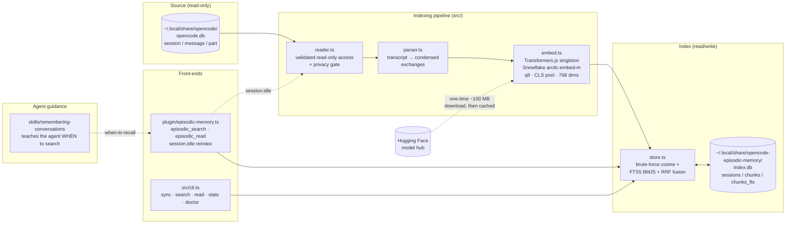
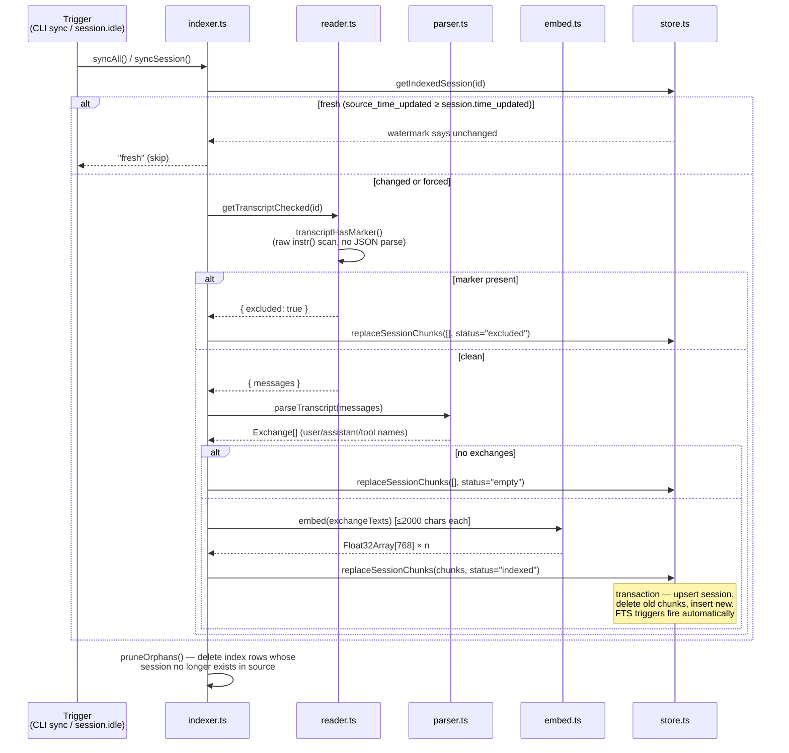
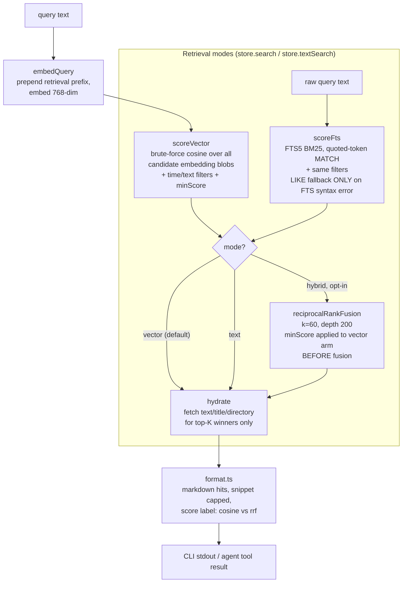

# Architecture

How opencode-episodic-memory works end to end: where data lives, how it flows
through the pipeline, and why the major design decisions are what they are.

For a guided tour of agent-relevant context, see [AGENTS.md](AGENTS.md). For
user-facing usage, see [README.md](README.md).

## System overview

The project is a pure TypeScript/Bun pipeline with two SQLite databases and no
servers, daemons, or network calls (except the one-time embedding-model
download). It reads OpenCode's session store, embeds condensed conversation
exchanges locally, and serves semantic search through two thin front-ends: an
OpenCode plugin (agent tools + auto-reindex) and a CLI (sync/search/read/stats/
doctor).



`src/format.ts` (not shown) is a shared presentation layer — date parsing,
transcript rendering, hit formatting — so the CLI and plugin can't drift apart.

## Module map

| Module | Role | Key exports |
|---|---|---|
| `src/reader.ts` | Read-only access to `opencode.db`. Zod validation; **authoritative privacy gate** | `listSessions`, `getSession`, `getTranscriptChecked`, `transcriptHasMarker`, `EXCLUDE_MARKER` |
| `src/parser.ts` | Transcript → condensed `Exchange[]` (user text, assistant text, tool names) | `parseTranscript`, `exchangeText`, `hasExcludeMarker` (fast path) |
| `src/embed.ts` | Local embeddings via Transformers.js; process-wide singleton pipeline | `embed` (docs), `embedQuery` (adds retrieval prefix), `QUERY_PREFIX`, `MAX_CHARS` |
| `src/store.ts` | Index SQLite schema + all retrieval (vector / BM25 / hybrid RRF) | `openIndex`, `replaceSessionChunks`, `search`, `textSearch`, `stats` |
| `src/indexer.ts` | Incremental, idempotent sync; watermark-based; orphan pruning | `syncSession`, `syncAll`, `pruneOrphans` |
| `src/format.ts` | Shared presentation for CLI + plugin | `parseDateArg`, `renderTranscript`, `formatHits` |
| `src/cli.ts` | `opencode-episodic` binary: sync / search / read / stats / doctor | — |
| `plugin/episodic-memory.ts` | OpenCode plugin: tools + `session.idle` reindex (debounced, fire-and-forget) | `EpisodicMemory` |
| `skills/remembering-conversations/` | Skill teaching the agent when to invoke the tools | — |

## Data model

Two databases, deliberately decoupled — the source can be deleted or drift
without invalidating the index, and the index can be rebuilt from scratch at
any time (`sync --force`).

### Source: `opencode.db` (read-only, owned by OpenCode)

```
session (id, project_id, parent_id, title, directory, time_created, time_updated, time_archived)
message (id, session_id, time_created, data)   -- data = JSON blob: {role, ...}
part    (id, session_id, message_id, time_created, data)  -- data = JSON blob: {type, text?, tool?}
```

Validation strategy is split by failure mode (enforced in `reader.ts`):

- **Structural rows** (the SELECTed columns) are parsed with Zod `.parse()` —
  they **throw** on drift, so an OpenCode schema change surfaces loudly instead
  of being silently mis-read. A structural drift aborts a whole bulk sync
  (all-or-nothing, intentional fail-loud).
- **JSON `data` blobs** degrade per-row via `.catch()` to `"unknown"` /
  `undefined`, so one corrupt or unfamiliar part shape never aborts a
  transcript read (the parser filters unknown types/roles downstream).

### Index: `index.db` (read/write, owned by this project)

```
sessions (id PK, project_id, parent_id, title, directory,
          time_created, source_time_updated, indexed_at,
          status)            -- 'indexed' | 'excluded' | 'empty'

chunks   (session_id, seq, time_created, text, embedding BLOB,
          PRIMARY KEY (session_id, seq))
         + chunks_time_idx on (time_created)

chunks_fts  FTS5 virtual table, external content over chunks.text,
            kept in sync by AFTER INSERT/DELETE/UPDATE triggers on chunks
```

- Embeddings are raw Float32 blobs (768 dims × 4 bytes). Vector search is
  brute-force cosine in JS — single-digit milliseconds at this scale (tens of
  thousands of chunks) with zero native-dependency risk. `bun:sqlite` cannot
  load dynamic extensions, so sqlite-vec is impossible inside the plugin; FTS5
  is compiled in, which is why lexical BM25 *is* available.
- `source_time_updated` is the incremental-sync watermark: a session is
  re-embedded only when the source changed since the last index run.
- `status` records why a session has no chunks (`indexed` | `excluded` |
  `empty`) and keeps a tombstone row (metadata only) so stats can report
  excluded/empty sessions. A changed session is always re-read and re-checked
  against the marker, so removing the marker from a conversation gets it
  indexed on the next sync.

> **Never VACUUM `index.db`.** The FTS5 external-content mapping rides
> `chunks`' implicit rowid (the PK is `(session_id, seq)`, no explicit
> `INTEGER PRIMARY KEY` alias), and VACUUM may renumber implicit rowids —
> silently misaligning every FTS posting from its chunk row. If VACUUM is ever
> needed, first migrate `chunks` to an explicit `rowid INTEGER PRIMARY KEY`.

## Write path: indexing

Two triggers feed the same code path: the CLI's `sync` command (bulk,
watermark-based, all-or-nothing on structural drift) and the plugin's
`session.idle` handler (single-session, debounced via an in-flight map,
fire-and-forget so it never blocks the conversation; also prunes orphans on
every idle so deleted conversations don't linger for plugin-only users).



Key properties:

- **Idempotent**: watermark = `session.time_updated`; re-running sync only
  touches changed sessions (`--force` bypasses).
- **Privacy-first**: the exclusion gate (`DO NOT INDEX THIS CHAT`) runs as a
  raw `instr()` substring scan over the unparsed `data` column *before* any
  transcript is materialized, inside `getTranscriptChecked()` — the single
  entry point all production reads go through (indexer, CLI `read`, plugin
  `episodic_read`). The raw `getTranscript` is module-internal, so no caller
  can bypass the gate by forgetting a check. The parser's `hasExcludeMarker()`
  is a cheaper parsed-text fast path only — it can miss the marker in
  unparseable blobs, which is exactly why the raw check is authoritative.
- **Self-healing**: orphan pruning removes index rows for sessions deleted
  from the source; search skips embedding rows whose byteLength ≠ dims×4, so a
  mixed-model index (e.g. mid-migration) can never crash or corrupt results.

## Read path: search & recall



Design notes on retrieval:

- **Two-phase search**: phase 1 scores candidates on embedding blobs (or BM25
  rank) only; phase 2 hydrates display fields via point lookups on the
  `(session_id, seq)` PK for just the winners (≤ 50 in the plugin). Per-query
  cost is dims arithmetic, not full-row materialization.
- **Vector-only by default.** Hybrid (vector + BM25 via RRF) is opt-in:
  empirically, on this corpus BM25 matches injected boilerplate (the `[MEMORY]`
  preamble, tool descriptions) and RRF drags that noise above genuine semantic
  hits. Hybrid scores are RRF-scale (~0.03), a *different* scale from cosine
  (~0.4–0.7) — output labels them `rrf:` so they're never misread against the
  cosine thresholds.
- **Asymmetric embedding**: queries get the BGE/Snowflake retrieval prefix
  ("Represent this sentence for searching relevant passages: "), documents go
  through unmodified. Pooling must be `cls` (not `mean`) for this model; both
  sides are L2-normalized, so cosine = dot product.
- **Truncation**: chunk text is capped at 4000 chars for storage/display;
  embedding input is further truncated to 2000 chars, where upstream measured
  retrieval quality peaks (the model's window is 512 tokens anyway).

`episodic_read` mirrors the same privacy gate: it reconstructs the transcript
from the live source DB via `getTranscriptChecked`, falling back to indexed
excerpts if the session was deleted (logging first, so structural drift isn't
silently masked).

## Key design decisions

| Decision | Rationale |
|---|---|
| Brute-force cosine, not sqlite-vec | `bun:sqlite` can't load dynamic extensions; brute force is single-digit ms at this scale. `store.ts` is **the** swap point if an ANN index is ever needed. |
| FTS5 external-content table + triggers | FTS5 is compiled into `bun:sqlite` (static module, not an extension). Triggers keep the index correct for *any* write path, not just `replaceSessionChunks`. |
| Hybrid off by default | BM25 matches injected boilerplate on this corpus; RRF then ranks noise above real hits. Opt-in via `hybrid: true` / `--hybrid` / `mode: "hybrid"`. |
| Privacy gate on raw blobs, single entry point | The opt-out marker must not depend on JSON parseability; funneling all reads through `getTranscriptChecked` makes bypass impossible by omission. |
| Zod on source reads only | Structural rows throw (fail-loud on OpenCode schema drift); JSON blobs degrade per-row. The index DB uses typed `prepare<T>()` casts — we own that schema end to end. No `as` assertions elsewhere. |
| Watermark incremental sync + orphan pruning | Cheap re-indexes; deleted conversations don't linger with stale embeddings. |
| Shared `format.ts` | CLI and plugin stay thin and can't drift apart in output formatting or date handling. |
| Env-var-only config (`EPISODIC_*`) | No config file yet (YAGNI). |

## Directory guide

```
src/       core library (reader, parser, embed, store, indexer, format, cli) + tests
plugin/    OpenCode plugin entrypoint (the npm package's main)
skills/    remembering-conversations skill (agent recall behavior)
spikes/    Phase-0 verification scripts + plugin harness (run with `bun run`)
eval/      embedding-model comparison harness (private corpus gitignored)
docs/      embedding-model eval, alternatives survey, release process
```

## Testing & verification

- `bun test` — parser + store + reader unit tests
- `bun run typecheck` — `tsc --noEmit`
- `bun run spikes/plugin-harness.ts` — plugin smoke harness; run after changing
  the plugin
- `bash spikes/pack-smoke.sh` — release gate: pack → clean install → import →
  embed
- `bun run src/cli.ts doctor` — end-to-end environment diagnosis (source DB
  readable, index writable, embedder working)
